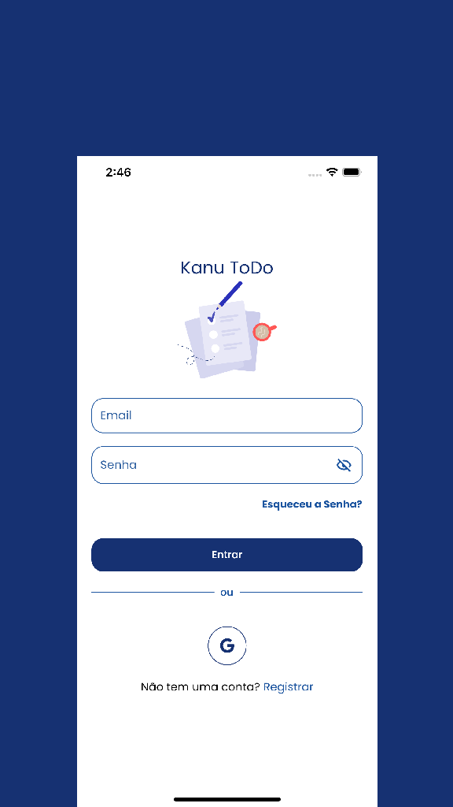
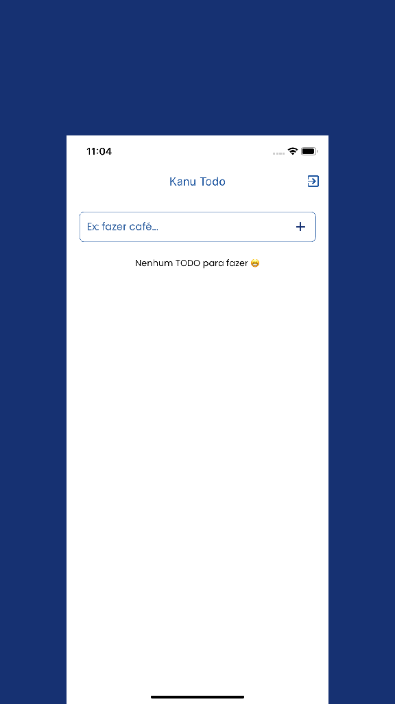
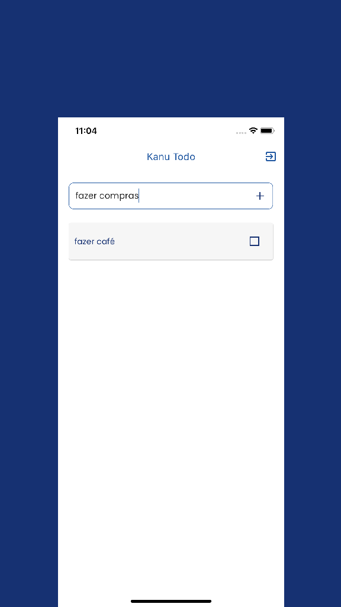

# Kanu ToDO

  

  
  
  
 

## Description

This project is a starting point for a Flutter application.

A few resources to get you started if this is your first Flutter project:

- [FireBase](https://firebase.google.com/)
